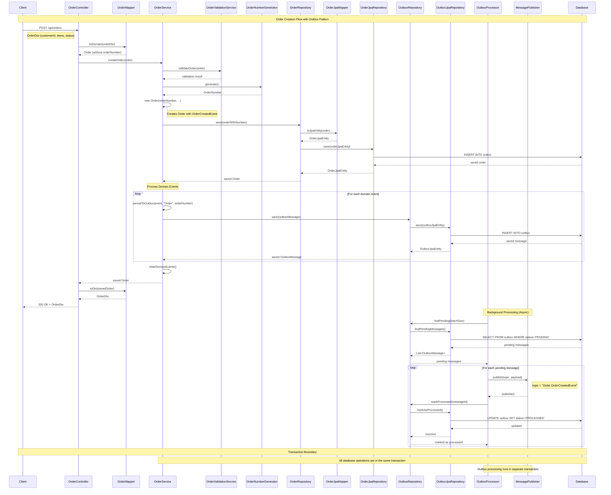

# Hexagonal Orders Application

## Overview
This project demonstrates a Spring Boot application implementing the Hexagonal Architecture (also known as Ports and Adapters) with the **Outbox Pattern** for reliable event publishing. The application manages orders and order items, showcasing clean architecture principles, separation of concerns, and reliable event-driven communication.

## Key Features
- **Hexagonal Architecture**: Clean separation between domain, application, and infrastructure layers
- **Outbox Pattern**: Reliable event publishing with transactional consistency
- **Comprehensive Testing**: Unit tests, integration tests, and end-to-end testing
- **Event-Driven Design**: Domain events for loose coupling between components
- **RESTful API**: Fully documented with Swagger/OpenAPI

## Project Structure
```
src/main/java/com/example/hexagonalorders/
├── domain/                    # Domain Layer (Core Business Logic)
│   ├── model/                # Domain Entities & Value Objects
│   │   ├── Order.java
│   │   ├── OrderItem.java
│   │   ├── OrderStatus.java
│   │   ├── OutboxMessage.java
│   │   ├── OutboxStatus.java
│   │   └── valueobject/
│   │       ├── OrderNumber.java
│   │       ├── ProductNumber.java
│   │       └── Quantity.java
│   ├── event/                # Domain Events
│   │   ├── DomainEvent.java
│   │   ├── OrderCreatedEvent.java
│   │   └── OrderItemAddedEvent.java
│   ├── port/                 # Domain Ports (Business Logic Interfaces)
│   │   ├── in/              # Input Ports (Use Cases)
│   │   │   └── OrderUseCase.java
│   │   └── out/             # Output Ports (Repositories, Services)
│   │       ├── OrderRepository.java
│   │       ├── OrderNumberGenerator.java
│   │       ├── OutboxRepository.java
│   │       └── MessagePublisher.java
│   └── service/             # Domain Services
│       └── OrderValidationService.java
├── application/              # Application Layer (Use Cases)
│   └── service/             # Application Services
│       └── OrderService.java
├── infrastructure/           # Infrastructure Layer
│   ├── config/              # Configuration
│   │   └── OrderConfiguration.java
│   ├── in/                  # Input Adapters (Primary/Driving)
│   │   └── web/            # Web Adapters
│   │       ├── OrderController.java
│   │       ├── dto/        # Data Transfer Objects
│   │       │   ├── OrderDto.java
│   │       │   └── OrderItemDto.java
│   │       └── mapper/     # DTO Mappers
│   │           └── OrderMapper.java
│   └── out/                # Output Adapters (Secondary/Driven)
│       ├── persistence/    # Persistence Adapters
│       │   ├── entity/     # JPA Entities
│       │   │   ├── OrderJpaEntity.java
│       │   │   ├── OrderItemJpaEntity.java
│       │   │   ├── OrderStatus.java
│       │   │   └── OutboxJpaEntity.java
│       │   ├── repository/ # JPA Repositories
│       │   │   ├── OrderJpaRepository.java
│       │   │   ├── OrderRepositoryAdapter.java
│       │   │   ├── OutboxMessageJpaRepository.java
│       │   │   └── OutboxRepositoryAdapter.java
│       │   └── mapper/    # Entity Mappers
│       │       ├── OrderJpaMapper.java
│       │       └── OutboxMessageMapper.java
│       ├── event/          # Event Processing
│       │   └── OutboxProcessor.java
│       ├── messaging/      # Message Publishing
│       │   └── NoOpMessagePublisher.java
│       └── orderNumber/   # Order Number Generation Adapters
│           └── UuidOrderNumberGenerator.java
└── HexagonalOrdersApplication.java
```

## Technologies Used
- **Java 21**
- **Spring Boot 3.2.3**
- **Spring Data JPA**
- **H2 Database**
- **Lombok**
- **Maven**
- **Springdoc OpenAPI (Swagger UI)**
- **Jackson JSR310** (for LocalDateTime serialization)

## Getting Started
1. Clone the repository
2. Build the project:
   ```bash
   mvn clean install
   ```
3. Run the application:
   ```bash
   mvn spring-boot:run
   ```

## API Endpoints
- `POST /api/orders` - Create a new order (no `id` or `orderNumber` in the request; both are generated by the backend)
- `GET /api/orders/{orderNumber}` - Get order by order number
- `DELETE /api/orders/{orderNumber}` - Delete an order

## H2 Database Console
The application uses H2 as an in-memory database. You can access the H2 console at:
- URL: http://localhost:8080/h2-console
- JDBC URL: jdbc:h2:mem:testdb
- Username: sa
- Password: (empty)

## API Documentation (Swagger/OpenAPI)
- The API is documented using Swagger/OpenAPI annotations.
- Access the interactive documentation at:
  - http://localhost:8080/swagger-ui.html
  - or http://localhost:8080/swagger-ui/index.html
- The input and output DTOs (`OrderDto`, `OrderItemDto`) are documented to indicate which fields are generated by the backend and which are required in the request.

## Outbox Pattern Implementation

### Overview
The application implements the **Outbox Pattern** to ensure reliable event publishing across system boundaries. This pattern guarantees that domain events are never lost, even if the external message broker is temporarily unavailable.

### How It Works
1. **Event Persistence**: When a domain event occurs, it's persisted to the `outbox` table in the same transaction as the business data
2. **Reliable Processing**: A background processor (`OutboxProcessor`) polls for pending messages and publishes them to external systems
3. **Idempotency**: Messages are processed with idempotency guarantees using composite indexes
4. **Error Handling**: Failed messages are marked and can be retried

### Key Components
- **OutboxMessage**: Domain model representing a message in the outbox
- **OutboxRepository**: Interface for outbox operations
- **OutboxProcessor**: Scheduled component that processes pending messages
- **MessagePublisher**: Interface for publishing messages to external systems
- **NoOpMessagePublisher**: Development implementation that logs messages to console

### Database Schema
```sql
CREATE TABLE outbox (
    id UUID PRIMARY KEY,
    aggregate_id UUID NOT NULL,
    aggregate_type VARCHAR(255) NOT NULL,
    event_type VARCHAR(255) NOT NULL,
    payload CLOB NOT NULL,
    status VARCHAR(255) NOT NULL,
    created_at TIMESTAMP NOT NULL,
    processed_at TIMESTAMP
);

CREATE INDEX idx_outbox_idempotency ON outbox (aggregate_id, event_type, created_at);
```

## Testing Strategy

### Test Types
1. **Unit Tests**: Test individual components in isolation
2. **Integration Tests**: Test the interaction between components
3. **End-to-End Tests**: Test complete user workflows

### Test Classes
- **OrderControllerIntegrationTest**: True integration tests using `@SpringBootTest` with real database operations
- **OrderServiceWithOutboxTest**: Service layer tests focusing on outbox persistence
- **OutboxIntegrationTest**: End-to-end testing of the outbox pattern

### Running Tests
```bash
# Run all tests
mvn test

# Run specific test class
mvn test -Dtest=OrderControllerIntegrationTest

# Run specific test method
mvn test -Dtest=OrderControllerIntegrationTest#createOrder_ShouldTriggerOutboxProcessing
```

### Test Configuration
- Uses H2 in-memory database for testing
- `@Transactional` for test isolation
- Jackson JSR310 module for LocalDateTime serialization
- Manual outbox processing for predictable test results

## Hexagonal Architecture Benefits
This project implements Hexagonal Architecture (Ports and Adapters) and provides several benefits:
1. **Domain-Centric Design**: The business logic is isolated from external concerns
2. **Clear Boundaries**: The architecture enforces clear boundaries between layers
3. **Testability**: Each layer can be tested independently
4. **Flexibility**: External dependencies can be easily swapped (e.g., database, UI, message broker)
5. **Maintainability**: Changes in one layer do not affect others
6. **Event-Driven**: Loose coupling through domain events
7. **Reliability**: Outbox pattern ensures no events are lost

## Architecture Notes
- **Domain Ports** (`port/in` and `port/out`) are only for business logic and persistence/service abstractions, not for web or infrastructure concerns.
- **OrderController** is implemented directly in the infrastructure layer as a REST adapter, not as a domain port.
- **Domain Events** are used for loose coupling between aggregates and external systems.
- **Outbox Pattern** ensures reliable event publishing without compromising transactional consistency.
- This structure keeps the domain layer free from any dependencies on frameworks or delivery mechanisms.

## Event Flow Example
1. **Order Creation**: `POST /api/orders` creates an order
2. **Domain Event**: `OrderCreatedEvent` is raised and persisted to outbox
3. **Transaction**: Order data and outbox message are saved atomically
4. **Processing**: `OutboxProcessor` picks up the pending message
5. **Publishing**: Message is published via `MessagePublisher` (logged to console in development)
6. **Completion**: Message is marked as processed

## Contributing
1. Fork the repository
2. Create a feature branch
3. Commit your changes
4. Push to the branch
5. Create a Pull Request

## License
This project is licensed under the MIT License - see the LICENSE file for details.

## Sequence Diagram: Order Creation Flow

The following sequence diagram illustrates the complete flow when creating an order through the REST API, including the outbox pattern implementation:



### Key Points in the Flow:

1. **Request Handling**: Client sends order data via REST API
2. **Domain Mapping**: DTO is converted to domain object (without orderNumber)
3. **Business Logic**: Order is validated and orderNumber is generated
4. **Domain Event Creation**: New Order with orderNumber creates OrderCreatedEvent
5. **Persistence**: Order and outbox message are saved in the same transaction
6. **Response**: Order is returned to client with generated orderNumber
7. **Background Processing**: OutboxProcessor picks up pending messages and publishes them
8. **Reliability**: If message publishing fails, message remains in outbox for retry

### Transaction Boundaries:
- **Main Transaction**: Order creation, validation, and outbox persistence
- **Background Transaction**: Message publishing and status updates
- **Idempotency**: Messages can be safely retried without duplication